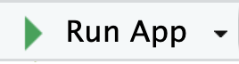

  

Welcome! This app was made as a way to quickly whip up other apps to practice SQL.  We needed a additional ways for students to practice their SQL skills, but also wanted a quick way for teachers without DBA skills to easily and quickly generate SQL practice tools.

## How to generate your app

* Go to the <kbd><i class="fa-solid fa-bolt-lightning"></i> Generate your app</kbd> page.
* Click the <kbd>Browse...</kbd> button and select your CSV files that you'd like to be included in the simulated database
  * Use the <kbd>Shift</kbd> and <kbd>Ctrl</kbd> keys to select multiple files (<kbd>Cmd</kbd> on Mac)
  * The names of the tables in the simulated SQL database will be based off the file names.  A file named `C:/Users/cooldude42/customers.csv` will result in a table named `customers`
    * Table names will be cleaned if needed to be 'legal' SQL names and also using some general SQL table name conventions
    * You will be responsible for ensuring table names don't clash with SQL's reserved words (i.e. a csv named `folder/FROM.csv` will fail)
* Run some test queries in the query editor to test things work as expected
* Click the <kbd>Download SQL app <i class="fa-solid fa-database"></i></kbd> button to download you app!
* Follow the below instructions on how to use your downloaded app as zip file

## How to use your generated app

* Unzip the downloaded zip file
  * On Windows: right click and click "Extract all..."
  * On Mac: double click on the zip file in Finder
* MAKE SURE TO KEEP THE FILES IN THE SAME EXACT FOLDER
* Open up your `sql-simulator-app.R` file in RStudio
* Click the Run App button that appears above the R file 
* Run queries!
* Upload to shinyapps.io to share with others!
  * Instructions coming soon prolly
* Report errors to Adam Spannbauer ([aspannba@utk.edu](mailto:aspannba@utk.edu))
